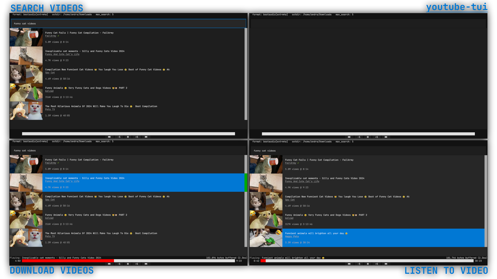

[](http://www.wtfpl.net/about/)


# youtube-tui

A TUI application to interface with youtube; complete with thumbnail view, and an audio player.

Built because youtube took too long to load.

# Used in This Project

- [Textual](https://github.com/Textualize/textual): a TUI library
- [yt-dlp](https://github.com/yt-dlp/yt-dlp): for access to YouTube api
- [python-mpv](https://github.com/jaseg/python-mpv): python binding for mpv C api
- [textual-image](https://github.com/lnqs/textual-image): for image rendering
- [path_input](https://github.com/tconbeer/textual-textarea/blob/main/src/textual_textarea/path_input.py): for path autocompletion

# License

```
           DO WHAT THE FUCK YOU WANT TO PUBLIC LICENSE
                   Version 2, December 2004

Copyright (C) 2024 ToyFarms

Everyone is permitted to copy and distribute verbatim or modified
copies of this license document, and changing it is allowed as long
as the name is changed.

           DO WHAT THE FUCK YOU WANT TO PUBLIC LICENSE
  TERMS AND CONDITIONS FOR COPYING, DISTRIBUTION AND MODIFICATION

 0. You just DO WHAT THE FUCK YOU WANT TO.
```
